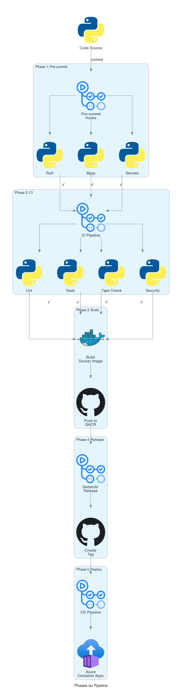
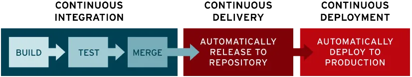
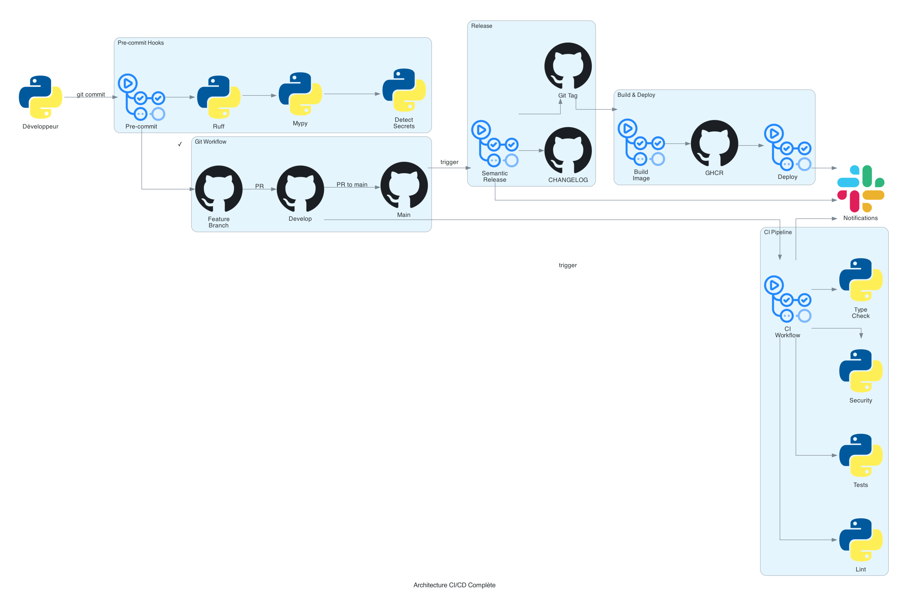
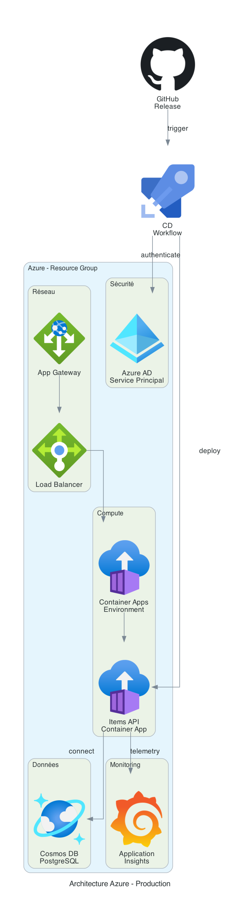

# 🚀 Brief CI/CD Professionnel - De la Veille au Déploiement


---

## 📖 Introduction

Vous allez mettre en place une **pipeline CI/CD professionnelle complète** pour une application FastAPI, depuis la compréhension des concepts jusqu'au déploiement automatisé sur Azure.

> ⚠️ **Approche pédagogique** : Ce brief commence par une phase de **veille technologique**. Vous devez comprendre les concepts avant de les appliquer !

---

## 🎯 Objectifs globaux

À la fin de ce projet, vous serez capable de :

- [ ] 🔍 Comprendre et expliquer les concepts de CI/CD
- [ ] 🛠️ Comparer et choisir les bons outils (linters, formatters, scanners)
- [ ] 🌿 Mettre en place une stratégie de branches professionnelle
- [ ] 🤖 Créer des workflows GitHub Actions complets
- [ ] 🛡️ Utiliser pre-commit hooks pour optimiser le développement
- [ ] 🐳 Containeriser et publier une application sur GHCR
- [ ] 📦 Automatiser le versionnage sémantique avec uv
- [ ] ☁️ Déployer automatiquement sur Azure

---

## 🗺️ Parcours d'apprentissage

<div align="center">
  
</div>

**8 phases progressives** du débutant à l'expert en CI/CD :

### 📊 Estimation du temps

| Phase | Titre | Durée | Difficulté |
|-------|-------|-------|------------|
| 📚 **Phase 0** | Veille technologique | 3-4h | ⭐ Facile |
| 🔍 **Phase 1** | Découverte du projet | 1h | ⭐ Facile |
| 🌿 **Phase 2** | Stratégie Git & Branches | 2h | ⭐⭐ Moyen |
| 🧪 **Phase 3** | CI - Tests & Quality | 4-5h | ⭐⭐⭐ Difficile |
| 🛡️ **Phase 4** | Pre-commit Hooks | 2h | ⭐⭐ Moyen |
| 🐳 **Phase 5** | Build & Push Docker | 2h | ⭐⭐ Moyen |
| 📦 **Phase 6** | Semantic Release | 3h | ⭐⭐⭐ Difficile |
| 📚 **Phase 7** | Documentation (bonus) | 2h | ⭐⭐ Moyen |
| ☁️ **Phase 8** | CD Azure (bonus) | 4-6h | ⭐⭐⭐⭐ Expert |

**Total** : 23-31 heures (15-20h sans les bonus)

---

## 🏗️ Architecture cible

<div align="center">
  
</div>

### Pipeline complète

<div align="center">
  
</div>

**Vue d'ensemble** : Du code source au déploiement automatique en passant par tous les contrôles qualité.

---

## 📚 Phase 0 : Veille Technologique


### 🎯 Objectif

**Comprendre les concepts** avant de les appliquer. Cette phase est **cruciale** pour réussir les phases suivantes.

### 📝 Missions de veille

#### Mission 1 : Comprendre CI/CD (1h)

**Ressources obligatoires** :
- 📖 [Red Hat - Qu'est-ce que la CI/CD ?](https://www.redhat.com/fr/topics/devops/what-is-ci-cd)
- 🎥 [GitHub Actions Tutorial](https://www.youtube.com/watch?v=R8_veQiYBjI) (30min)

**Questions à documenter** :

1. **Qu'est-ce que la CI (Continuous Integration) ?**
   - Quels problèmes résout-elle ?
   - Quels sont les principes clés ?
   - Donnez 3 exemples d'outils de CI

2. **Qu'est-ce que le CD (Continuous Deployment/Delivery) ?**
   - Différence entre Continuous Delivery et Continuous Deployment ?
   - Quels sont les risques et bénéfices ?

3. **Pourquoi CI/CD est important ?**
   - Impact sur la qualité du code
   - Impact sur la vitesse de développement
   - Impact sur la collaboration en équipe

**Livrable** : Document `VEILLE_CICD.md` avec vos réponses

---

#### Mission 2 : Maîtriser uv (1h)

**Ressources obligatoires** :
- 📖 [Documentation uv](https://docs.astral.sh/uv/)
- 📖 [uv - GitHub Integration](https://docs.astral.sh/uv/guides/integration/github/)
- 📖 [uv - Build Backend](https://docs.astral.sh/uv/concepts/build-backend/#modules)
- 🎥 [uv Tutorial](https://www.youtube.com/watch?v=mFyE9xgeKcA&t=1040s)

**Questions à documenter** :

1. **Qu'est-ce que uv ?**
   - En quoi est-ce différent de pip/poetry/pipenv ?
   - Quels sont les avantages ?

2. **Comment uv fonctionne avec pyproject.toml ?**
   - Structure du fichier
   - Gestion des dépendances (séparé par sections)
   - Build backend

3. **Comment utiliser uv dans GitHub Actions ?**
   - Installation
   - Cache des dépendances
   - Exécution de commandes

**Livrable** : Section dans `VEILLE_CICD.md`

---

#### Mission 3 : Comprendre Semantic Release (30min)

**Ressources obligatoires** :
- 📖 [Conventional Commits](https://www.conventionalcommits.org/fr/v1.0.0/)
- 📖 [Conventional Commits - Gist](https://gist.github.com/qoomon/5dfcdf8eec66a051ecd85625518cfd13)
- 📖 [Python Semantic Release](https://python-semantic-release.readthedocs.io/)

**Questions à documenter** :

1. **Qu'est-ce que le versionnage sémantique (SemVer) ?**
   - Format MAJOR.MINOR.PATCH
   - Quand bumper chaque niveau ?

2. **Qu'est-ce que Conventional Commits ?**
   - Format des messages
   - Types de commits (feat, fix, etc.)
   - Impact sur le versionnage

3. **Comment python-semantic-release fonctionne ?**
   - Configuration dans pyproject.toml
   - Génération du CHANGELOG
   - Création des releases GitHub

**Livrable** : Section dans `VEILLE_CICD.md`

---

#### Mission 4 : Comparatif d'outils (1-2h)

**Objectif** : Comparer les outils disponibles pour chaque catégorie et **justifier vos choix**.

##### 🎨 Linters Python

Comparez :
- **Ruff** (moderne, rapide)
- **Flake8** (classique)
- **Pylint** (complet mais lent)

**Critères** : Vitesse, règles, facilité d'utilisation, communauté

##### 🎨 Formatters Python

Comparez :
- **Ruff format** (rapide, compatible Black)
- **Black** (opinionated)
- **autopep8** (plus permissif)

**Critères** : Vitesse, customisation, adoption

##### 🔒 Type Checkers

Comparez :
- **Mypy** (référence)
- **Pyright** (rapide, utilisé par VS Code)
- **Pyre** (Facebook)

**Critères** : Précision, vitesse, intégration IDE

##### 🧪 Frameworks de Tests

Comparez :
- **pytest** (flexible, plugins)
- **unittest** (standard library)

**Critères** : Facilité, plugins, assertions

##### 🔐 Security Scanners

Comparez : OPTIONAL
- **Bandit** (static analysis)
- **Safety** (dependencies vulnerabilities)
- **Snyk** (commercial mais puissant)
- **Trivy** (container scanning)

**Critères** : Types de vulnérabilités détectées, false positives, coût

##### 📋 Tableau comparatif attendu

| Outil | Catégorie | Avantages | Inconvénients | Note /10 | Choix ? |
|-------|-----------|-----------|---------------|----------|---------|
| Ruff | Linter | Ultra rapide, tout-en-un | Moins de règles que Pylint | 9/10 | ✅ |
| ... | ... | ... | ... | ... | ... |

**Livrable** : Document `COMPARATIF_OUTILS.md` avec tableaux et justifications

---

#### Mission 5 : MkDocs & GitHub Pages (bonus, 30min)

**Ressources** :
- 📖 [MkDocs](https://www.mkdocs.org/)
- 📖 [MkDocs Material](https://squidfunk.github.io/mkdocs-material/)
- 📖 [GitHub Pages](https://pages.github.com/)

**Questions** :
- Comment MkDocs génère de la documentation ?
- Comment déployer sur GitHub Pages ?
- Qu'est-ce que mkdocstrings ?

**Livrable** : Section dans `VEILLE_CICD.md`

---

### ✅ Validation Phase 0

- [ ] `VEILLE_CICD.md` complet avec toutes les réponses
- [ ] `COMPARATIF_OUTILS.md` avec justifications de choix
- [ ] Compréhension claire de CI/CD, uv, semantic release
- [ ] Choix d'outils justifiés pour votre projet

---

## 🔍 Phase 1 : Découverte du Projet


### 🎯 Objectif

Explorer le projet existant, le faire fonctionner, et **identifier les problèmes de qualité**.

### 📝 Étapes

#### 1.1 Installation avec uv

```bash
# Cloner le projet
git clone <votre-repo>
cd items-ci-cd

# Installer uv (si pas déjà fait)
curl -LsSf https://astral.sh/uv/install.sh | sh

# Synchroniser les dépendances
uv sync

# Lancer l'application
uv run fastapi dev app/main.py
```

#### 1.2 Tester l'API

```bash
# Health check
curl http://localhost:8000/health

# Documentation interactive
open http://localhost:8000/docs

# Créer un item
curl -X POST http://localhost:8000/items \
  -H "Content-Type: application/json" \
  -d '{"nom": "Laptop", "prix": 999.99}'

# Lister les items
curl http://localhost:8000/items
```

✅ **Checkpoint** : L'API fonctionne-t-elle ?

#### 1.3 Explorer le code

Examinez la structure :

```
app/
├── main.py         # Point d'entrée
├── database.py     # Config DB
├── models/         # Modèles SQLModel
├── routes/         # Endpoints API
├── schemas/        # Schémas Pydantic
└── services/       # Logique métier
```

#### 1.4 Identifier les problèmes

**Mission** : Créez un document `PROBLEMES_DETECTES.md` listant **tous** les problèmes de qualité que vous trouvez.

Catégories à vérifier :
- 🎨 **Formatage** : Espaces, lignes trop longues, indentation
- 🔒 **Sécurité** : Secrets en dur, mots de passe, clés API
- 📦 **Imports** : Inutilisés, mal ordonnés, dupliqués
- 🏷️ **Types** : Fonctions non typées, any implicites
- 📝 **Documentation** : Docstrings manquantes ou incomplètes
- ♻️ **Code mort** : Variables inutilisées, fonctions obsolètes, code commenté

**Outils à utiliser** :

```bash
# Linting
uv run ruff check .

# Type checking
uv run mypy app/

# Tests (si existants)
uv run pytest
```

### ❓ Questions de réflexion

1. **Le code fonctionne, mais** :
   - Est-il maintenable ?
   - Est-il sécurisé ?
   - Est-il bien documenté ?

2. **Comment détecter ces problèmes automatiquement ?**
   - Quels outils utiliser ?
   - À quel moment les exécuter ?

3. **Comment empêcher ces problèmes à l'avenir ?**

### ✅ Validation Phase 1

- [ ] L'application fonctionne localement
- [ ] Vous avez testé tous les endpoints
- [ ] `PROBLEMES_DETECTES.md` contient au moins 20 problèmes identifiés
- [ ] Vous comprenez la structure du projet

---

## 🌿 Phase 2 : Stratégie de Branches & Conventional Commits


### 🎯 Objectif

Mettre en place une **stratégie de branches professionnelle** avec protection et règles strictes.

### 📖 Comprendre GitFlow simplifié

<div align="center">
  
</div>

**Le flux de travail** :
- **Develop** : Branche d'intégration continue
- **Feature branches** : Une branche par fonctionnalité
- **Main** : Branche de production (releases seulement)

### 📝 Étapes

#### 2.1 Créer les branches principales

```bash
# Vous êtes sur main (ou master)
git checkout -b develop
git push -u origin develop

# Retourner sur main
git checkout main
```

#### 2.2 Configurer la protection de branches sur GitHub (Attention à ne pas oublier de créer un Giuthub APP pour valider les pull requests)

**Sur GitHub** : Settings → Branches → Branch protection rules

##### Protection de `main`

Créez une règle pour `main` :

- [ ] ✅ **Require pull request before merging**
  - Require approvals: 1 (mettre le formateur comme approver sur le repo)
- [ ] ✅ **Require status checks to pass before merging**
  - Cochez : CI, Lint, Tests (vous les ajouterez plus tard)
- [ ] ✅ **Require conversation resolution before merging**
- [ ] ✅ **Do not allow bypassing the above settings**
- [ ] ✅ **Restrict who can push to matching branches** (optionnel)

##### Protection de `develop`

Créez une règle pour `develop` :

- [ ] ✅ **Require pull request before merging**
- [ ] ✅ **Require status checks to pass before merging**
- [ ] ⚠️ Moins stricte que `main` (pas besoin d'approval)

**Résultat** : Impossible de push directement sur `main` ou `develop` !

#### 2.3 Workflow de développement

<div align="center">
  
</div>

**Flux de travail quotidien** :
1. Créer une branche depuis `develop`
2. Développer + commits conventionnels
3. Push + ouvrir une PR vers `develop`
4. CI s'exécute automatiquement
5. Merge si CI passe
6. Quand prêt : PR `develop` → `main` → Release automatique !

**Règles à respecter** :

1. **Jamais** de commit direct sur `main` ou `develop`
2. **Toujours** créer une feature branch : `feature/nom-de-la-feature`
3. **Toujours** utiliser des Conventional Commits
4. **Toujours** créer une PR (Pull Request)
5. **Toujours** attendre que la CI passe

#### 2.4 Conventional Commits

Format obligatoire :

```
<type>(<scope>): <description>

[corps optionnel]

[footer optionnel]
```

**Types autorisés** :

| Type | Description | Exemple | Version Bump |
|------|-------------|---------|--------------|
| `feat` | Nouvelle fonctionnalité | `feat(items): add pagination` | MINOR (0.1.0 → 0.2.0) |
| `fix` | Correction de bug | `fix(api): handle null values` | PATCH (0.1.0 → 0.1.1) |
| `docs` | Documentation uniquement | `docs: update README` | Aucun |
| `style` | Formatage, whitespace | `style: format with ruff` | Aucun |
| `refactor` | Refactoring | `refactor: extract service layer` | Aucun |
| `perf` | Amélioration performance | `perf: optimize db queries` | PATCH |
| `test` | Ajout de tests | `test: add items tests` | Aucun |
| `chore` | Maintenance, config | `chore: update dependencies` | Aucun |
| `ci` | CI/CD changes | `ci: add GitHub Actions` | Aucun |

**Breaking Changes** (MAJOR bump : 1.0.0 → 2.0.0) :

```bash
# Option 1 : avec !
git commit -m "feat!: redesign API structure"

# Option 2 : avec BREAKING CHANGE footer
git commit -m "feat: redesign API

BREAKING CHANGE: endpoints /api/v1/* are removed"
```

**Ressources** :
- 📖 [Conventional Commits](https://www.conventionalcommits.org/fr/v1.0.0/)
- 📖 [Conventional Commits - Cheatsheet](https://gist.github.com/qoomon/5dfcdf8eec66a051ecd85625518cfd13)

#### 2.5 Exercice pratique

**Mission** : Créez votre première feature branch avec un commit conventionnel.

```bash
# Depuis develop
git checkout develop
git pull origin develop

# Créer une feature branch
git checkout -b feature/fix-formatting

# Fixer QUELQUES problèmes de formatage (pas tous !)
# Par exemple, dans app/main.py, supprimez les imports inutilisés

# Commit avec format conventionnel
git commit -m "style: remove unused imports in main.py"

# Push
git push -u origin feature/fix-formatting

# Sur GitHub : Créer une PR vers develop
```

### ❓ Questions de réflexion

1. **Pourquoi protéger les branches ?**
   - Que se passerait-il sans protection ?

2. **Pourquoi Conventional Commits ?**
   - Avantages pour l'équipe
   - Avantages pour le versionnage automatique

3. **Différence entre develop et main ?**
   - Quand merger dans develop ?
   - Quand merger dans main ?

### ✅ Validation Phase 2

- [ ] Branches `main` et `develop` créées
- [ ] Protection de branches configurée sur GitHub
- [ ] Au moins 1 PR créée avec Conventional Commit
- [ ] Vous comprenez le workflow GitFlow

---

## 🧪 Phase 3 : CI Pipeline - Tests, Quality & Security


### 🎯 Objectif

Créer un **pipeline CI complet** qui vérifie automatiquement la qualité, les tests, et la sécurité du code.

### 📊 Architecture du CI Pipeline

**4 jobs parallèles** pour une vérification complète :

```
┌─────────────────────────────────────────────────┐
│          PUSH / PULL REQUEST                    │
└───────────────┬─────────────────────────────────┘
                │
    ┌───────────┼───────────┬───────────┐
    │           │           │           │
    ▼           ▼           ▼           ▼
┌────────┐ ┌─────────┐ ┌─────────┐ ┌────────┐
│  LINT  │ │  TYPE   │ │ SECURITY│ │ TESTS  │
│        │ │  CHECK  │ │         │ │        │
├────────┤ ├─────────┤ ├─────────┤ ├────────┤
│ • Ruff │ │ • Mypy  │ │ • Bandit│ │ • Setup│
│ check  │ │         │ │ • Safety│ │   DB   │
│ • Ruff │ │         │ │         │ │ • Pytest│
│ format │ │         │ │         │ │ • Cover│
└────┬───┘ └────┬────┘ └────┬────┘ └───┬────┘
     │          │           │          │
     └──────────┴───────────┴──────────┘
                │
                ▼
         ┌──────────────┐
         │  ALL PASS?   │
         └──────┬───────┘
                │
        ┌───────┴────────┐
        │                │
        ▼                ▼
    ✅ SUCCESS      ❌ FAILED
```

**Tous les jobs doivent passer** pour que la CI soit verte !

### 📝 Étapes

#### 3.1 Comprendre GitHub Actions

**Structure d'un workflow** :

```yaml
name: Nom du workflow
on: [événements qui déclenchent]
jobs:
  nom-du-job:
    runs-on: ubuntu-latest
    steps:
      - name: Étape 1
        run: commande
```

**Ressources** :
- 📖 [GitHub Actions - Quickstart](https://docs.github.com/en/actions/quickstart)
- 📖 [GitHub Actions - Workflow syntax](https://docs.github.com/en/actions/using-workflows/workflow-syntax-for-github-actions)
- 📖 [uv - GitHub Integration](https://docs.astral.sh/uv/guides/integration/github/)

#### 3.2 Créer le workflow CI

Créez `.github/workflows/ci.yml` :

**Mission** : Créez un workflow avec les jobs suivants :

##### Job 1 : Lint & Format

```yaml
lint:
  runs-on: ubuntu-latest
  steps:
    - uses: actions/checkout@v4

    # TODO: Installer uv
    # Indice : https://docs.astral.sh/uv/guides/integration/github/

    # TODO: Installer les dépendances
    # uv sync

    # TODO: Exécuter ruff check
    # uv run ruff check .

    # TODO: Vérifier le formatage
    # uv run ruff format --check .
```

##### Job 2 : Type Check

```yaml
typecheck:
  runs-on: ubuntu-latest
  steps:
    # TODO: Checkout, install uv, sync deps

    # TODO: Exécuter mypy
    # uv run mypy app/
```

##### Job 3 : Security Scan

```yaml
security:
  runs-on: ubuntu-latest
  steps:
    # TODO: Checkout, install uv, sync deps

    # TODO: Bandit (static analysis)
    # uv run bandit -r app/

    # TODO: Safety (check dependencies vulnerabilities)
    # uv run safety check
```

##### Job 4 : Tests

```yaml
tests:
  runs-on: ubuntu-latest

  # TODO: Ajouter un service PostgreSQL
  # Indice : https://docs.github.com/en/actions/using-containerized-services
  services:
    postgres:
      image: postgres:15
      env:
        POSTGRES_PASSWORD: postgres
        POSTGRES_DB: test_db
      options: >-
        --health-cmd pg_isready
        --health-interval 10s
        --health-timeout 5s
        --health-retries 5
      ports:
        - 5432:5432

  steps:
    # TODO: Checkout, install uv, sync deps

    # TODO: Run tests with coverage
    # uv run pytest --cov=app --cov-report=term --cov-report=xml

    # TODO: Upload coverage to Codecov (optionnel)
```

**📋 Template de départ** :

```yaml
name: CI

on:
  push:
    branches: [main, develop]
  pull_request:
    branches: [main, develop]

jobs:
  lint:
    # TODO: À compléter

  typecheck:
    # TODO: À compléter

  security:
    # TODO: À compléter

  tests:
    # TODO: À compléter
```

#### 3.3 Configurer les outils

##### pyproject.toml - Ruff

```toml
[tool.ruff]
line-length = 88
target-version = "py313"

[tool.ruff.lint]
select = [
    "E",  # pycodestyle errors
    "W",  # pycodestyle warnings
    "F",  # pyflakes
    "I",  # isort
    "B",  # flake8-bugbear
    "C4", # flake8-comprehensions
    "UP", # pyupgrade
]
ignore = []

[tool.ruff.format]
quote-style = "double"
indent-style = "space"
```

##### pyproject.toml - Mypy

```toml
[tool.mypy]
python_version = "3.13"
warn_return_any = true
warn_unused_configs = true
disallow_untyped_defs = true
plugins = ["sqlalchemy.ext.mypy.plugin"]
```

##### pyproject.toml - Pytest

```toml
[tool.pytest.ini_options]
testpaths = ["tests"]
python_files = "test_*.py"
python_functions = "test_*"
addopts = "--strict-markers --cov=app --cov-report=term-missing"
```

#### 3.4 Corriger les problèmes

Maintenant que la CI est en place, elle va **détecter tous les problèmes** !

**Mission** : Créez des PR pour corriger les problèmes par catégorie.

**Workflow recommandé** :

```bash
# 1. Créer une branche pour les imports inutilisés
git checkout develop
git checkout -b fix/remove-unused-imports

# 2. Corriger (avec l'aide de ruff --fix)
uv run ruff check --fix .

# 3. Commit conventionnel
git add .
git commit -m "style: remove unused imports"

# 4. Push et créer PR
git push -u origin fix/remove-unused-imports
```

Répétez pour chaque catégorie :
- `fix/remove-unused-imports`
- `fix/add-type-annotations`
- `fix/remove-secrets` ⚠️ (Important !)
- `fix/format-code`
- `fix/remove-dead-code`

#### 3.5 Optimiser le CI

**Cache des dépendances** :

```yaml
- name: Set up uv
  uses: astral-sh/setup-uv@v4
  with:
    enable-cache: true
    cache-dependency-glob: "uv.lock"
```

**Parallel jobs** : Les jobs s'exécutent déjà en parallèle par défaut !

**Matrix builds** (optionnel - plusieurs versions Python) :

```yaml
strategy:
  matrix:
    python-version: ["3.12", "3.13"]
```

### ❓ Questions de réflexion

1. **Pourquoi plusieurs jobs séparés ?**
   - Avantages du parallélisme
   - Facilité de déboggage

2. **Que faire si la CI échoue ?**
   - Comment lire les logs ?
   - Comment reproduire localement ?

3. **Faut-il tout corriger d'un coup ?**
   - Avantages des petites PR
   - Facilité de review

### ✅ Validation Phase 3

- [ ] Workflow `.github/workflows/ci.yml` créé
- [ ] Tous les jobs (lint, typecheck, security, tests) fonctionnent
- [ ] La CI s'exécute automatiquement sur chaque push/PR
- [ ] Au moins 50% des problèmes détectés sont corrigés
- [ ] Les tests passent
- [ ] Configuration ruff, mypy, pytest dans `pyproject.toml`

---

## 🛡️ Phase 4 : Pre-commit Hooks - Gagnez du Temps !


### 🎯 Objectif

Bloquer les problèmes **AVANT** qu'ils n'arrivent dans la CI. **C'est le game changer !**

### 💡 Le Concept - Avant/Après

#### ❌ Sans pre-commit (approche traditionnelle)

```
👨‍💻 Développeur
    │
    ├─ 1. git commit (code avec erreurs)
    ├─ 2. git push
    │
    ▼
🤖 CI Pipeline (3-5 minutes)
    │
    ├─ ❌ ÉCHEC ! (erreurs détectées)
    │
    ▼
👨‍💻 Développeur
    │
    ├─ 3. Corriger localement
    ├─ 4. git commit + push
    │
    ▼
🤖 CI Pipeline (3-5 minutes)
    │
    └─ ✅ SUCCESS

⏱️ TOTAL : 6-10 minutes perdues
```

#### ✅ Avec pre-commit (approche optimisée)

```
👨‍💻 Développeur
    │
    ├─ 1. git commit (code avec erreurs)
    │
    ▼
🛡️ Pre-commit (5 secondes)
    │
    ├─ ❌ BLOQUÉ ! (erreurs détectées)
    │
    ▼
👨‍💻 Développeur
    │
    ├─ 2. Corriger immédiatement
    ├─ 3. git commit (corrigé)
    │
    ▼
🛡️ Pre-commit (5 secondes)
    │
    ├─ ✅ OK
    ├─ 4. git push
    │
    ▼
🤖 CI Pipeline
    │
    └─ ✅ SUCCESS (premier coup !)

⏱️ TOTAL : 30 secondes + CI
```

**🚀 Gain de temps : 90% !**
**💡 Bonus : Moins de cycles CI = coût réduit + environnement**

### 📝 Ressources

- 📖 [Pre-commit.com](https://pre-commit.com/)
- 🎥 [Pre-commit Tutorial](https://www.youtube.com/watch?v=xhg1dJHLqSM)

### 📝 Étapes

#### 4.1 Installation

```bash
# Installer pre-commit
uv pip install pre-commit

# Vérifier
pre-commit --version
```

#### 4.2 Configuration

créer le fichier `.pre-commit-config.yaml` :

```bash
touch .pre-commit-config.yaml
```

**Mission** : Complétez le fichier `.pre-commit-config.yaml` avec les hooks suivants.

##### Hooks de base

```yaml
repos:
  - repo: https://github.com/pre-commit/pre-commit-hooks
    rev: v4.5.0
    hooks:
      - id: trailing-whitespace
      - id: end-of-file-fixer
      - id: check-yaml
      - id: check-added-large-files
      - id: detect-private-key
      - id: check-merge-conflict
```

##### Ruff (linting + formatting)

```yaml
  - repo: https://github.com/astral-sh/ruff-pre-commit
    rev: v0.6.0
    hooks:
      - id: ruff
        args: [--fix]
      - id: ruff-format
```

##### Mypy (type checking)

```yaml
  - repo: https://github.com/pre-commit/mirrors-mypy
    rev: v1.11.0
    hooks:
      - id: mypy
        additional_dependencies:
          - sqlmodel
          - fastapi
          - types-psycopg2
```

##### (Optionnel) Detect Secrets

```yaml
  - repo: https://github.com/Yelp/detect-secrets
    rev: v1.4.0
    hooks:
      - id: detect-secrets
        args: ['--baseline', '.secrets.baseline']
```

Pour initialiser la baseline :
```bash
uv run detect-secrets scan > .secrets.baseline
```

#### 4.3 Installation des hooks Git

```bash
# Installer les hooks dans .git/hooks/
pre-commit install

# Tester sur tous les fichiers
pre-commit run --all-files
```

**Attendez-vous à beaucoup d'erreurs !** 😅

#### 4.4 Corriger progressivement

Pre-commit va auto-fixer certains problèmes :
- Trailing whitespace
- End of file
- Formatage (ruff-format)
- Imports (ruff avec --fix)

D'autres nécessitent une correction manuelle :
- Type annotations
- Secrets détectés

**Workflow** :

```bash
# Tentative de commit
git add app/main.py
git commit -m "fix: remove secrets"

# Pre-commit s'exécute...
# ❌ Certains hooks échouent
# ✅ Certains auto-fixent

# Si auto-fixé, re-add et re-commit
git add app/main.py
git commit -m "fix: remove secrets"

# Cette fois ça devrait passer !
```

#### 4.5 Ajouter pre-commit à la CI

**Pourquoi ?** Éviter que quelqu'un bypass les hooks avec `--no-verify`.

Ajoutez un job dans `.github/workflows/ci.yml` :

```yaml
pre-commit:
  runs-on: ubuntu-latest
  steps:
    - uses: actions/checkout@v4
    - uses: actions/setup-python@v5
    - uses: pre-commit/action@v3.0.0
```

### ❓ Questions de réflexion

1. **Différence entre pre-commit et CI ?**
   - Quand chacun s'exécute ?
   - Pourquoi avoir les deux ?

2. **Peut-on bypass pre-commit ?**
   - `git commit --no-verify`
   - Est-ce une bonne idée ?
   - Comment l'empêcher ?

3. **Pre-commit ralentit-il le développement ?**
   - Temps d'exécution (5-10 secondes)
   - Vs temps perdu à attendre la CI

### ✅ Validation Phase 4

- [ ] `.pre-commit-config.yaml` complet et fonctionnel
- [ ] `pre-commit install` exécuté
- [ ] Tous les hooks passent sur `pre-commit run --all-files`
- [ ] Vous avez testé un commit → bloqué → corrigé → passé
- [ ] Pre-commit ajouté à la CI
- [ ] La majorité des problèmes de qualité sont corrigés

---

## 🐳 Phase 5 : Build & Push Docker Image vers GHCR


### 🎯 Objectif

Containeriser l'application et publier l'image Docker sur **GitHub Container Registry (GHCR)**.

### 📖 Comprendre GHCR

GitHub Container Registry (ghcr.io) :
- Gratuit pour les repos publics
- Intégré à GitHub
- Support multi-arch
- Authentification via `GITHUB_TOKEN`

### 📝 Étapes

#### 5.1 Créer le Dockerfile

Vérifiez/améliorez le `Dockerfile` existant :

```dockerfile
FROM python:3.13-slim

WORKDIR /app

RUN apt-get update && apt-get install -y \
    gcc \
    postgresql-client \
    curl \
    && rm -rf /var/lib/apt/lists/*

COPY --from=ghcr.io/astral-sh/uv:latest /uv /usr/local/bin/uv

ENV UV_SYSTEM_PYTHON=1

COPY pyproject.toml .
RUN uv pip install -e .

COPY . .

EXPOSE 8000

CMD ["fastapi", "run", "app/main.py", "--port", "8000"]
```

**Optimisations** :
- Multi-stage build → image plus petite
- uv pour des installations rapides
- Cache des layers Docker

#### 5.2 Tester localement

```bash
# Build
docker build -t items-api:local .

# Run
docker run -p 8000:8000 items-api:local

# Test
curl http://localhost:8000/health
```

#### 5.3 Créer le workflow de build

Créez `.github/workflows/build.yml` :

```yaml
name: Build & Push Docker Image

on:
  push:
    branches: [main, develop]
  pull_request:
    branches: [main]

env:
  REGISTRY: ghcr.io
  IMAGE_NAME: ${{ github.repository }}

jobs:
  build-and-push:
    runs-on: ubuntu-latest
    permissions:
      contents: read
      packages: write

    steps:
      - name: Checkout code
        uses: actions/checkout@v4

      - name: Set up Docker Buildx
        uses:

      - name: Log in to GitHub Container Registry
        uses:

      - name: Extract metadata
        id: meta
        uses:

      - name: Build and push Docker image
        uses:

```

**Ce workflow** :
- Build l'image Docker
- Tag automatiquement (branch, SHA, version)
- Push vers GHCR
- Utilise le cache GitHub Actions pour accélérer

#### 5.4 Vérifier sur GHCR

Après le workflow :

1. Allez sur GitHub → Packages (profil)
2. Vous devriez voir `items-ci-cd` (ou votre nom de repo)
3. L'image est tagguée avec la branche et le SHA

URL de l'image : `ghcr.io/<votre-username>/items-ci-cd:main`

#### 5.5 Utiliser l'image

```bash
# Pull depuis GHCR
docker pull ghcr.io/<votre-username>/items-ci-cd:main

# Run
docker run -p 8000:8000 ghcr.io/<votre-username>/items-ci-cd:main
```

### ❓ Questions de réflexion

1. **Pourquoi containeriser ?**
   - Avantages Docker
   - "Works on my machine" problem

2. **Multi-stage build : pourquoi ?**
   - Taille de l'image
   - Sécurité

3. **Tagging strategy** :
   - Pourquoi plusieurs tags ?
   - `latest` vs `semver` vs `sha`

### ✅ Validation Phase 5

- [ ] `Dockerfile` optimisé créé
- [ ] Image build et run localement
- [ ] Workflow `.github/workflows/build.yml` créé
- [ ] Image pushée sur GHCR
- [ ] Image pullable et fonctionnelle depuis GHCR

---

## 📦 Phase 6 : Semantic Release Automatique


### 🎯 Objectif

Automatiser complètement le versionnage et la création de releases grâce à **python-semantic-release** et **uv**.

### 📖 Configuration existante

Le projet est déjà configuré dans `pyproject.toml` :

```toml
[tool.semantic_release]


[tool.semantic_release.branches.main]


[tool.semantic_release.branches.develop]


[tool.semantic_release.changelog]


[tool.semantic_release.commit_parser_options]


[tool.semantic_release.remote]

[tool.semantic_release.publish]

```

**Examinez cette configuration** et répondez :

1. Quels commits déclenchent un bump de version ?
2. Différence entre `main` et `develop` ?
3. Que contient le CHANGELOG ?

### 📝 Étapes

#### 6.1 Tester localement (dry-run)

```bash
# Voir quelle version serait créée (sans rien modifier)
uv run semantic-release version --dry-run

# Voir le changelog qui serait généré
uv run semantic-release changelog --dry-run
```

Si aucune version n'est détectée, c'est normal ! Il faut des commits `feat` ou `fix`.

#### 6.2 Créer des commits pour tester

```bash
git checkout develop
git checkout -b feature/test-release

# Faites un petit changement
echo "# Test" >> README.md

git add README.md
git commit -m "feat: add test section to README"

# Push et créer une PR vers develop
git push -u origin feature/test-release
```

Mergez la PR dans `develop`.

#### 6.3 Créer le workflow de release

Créez `.github/workflows/release.yml` :

```yaml
name: Semantic Release

on:
  workflow_run:
    workflows: ["CI"]
    types:
      - completed
    branches:
      - main
      - develop

permissions:
  contents: write
  packages: write
  issues: write
  pull-requests: write

jobs:
  release:
    # Ne s'exécute que si la CI a réussi
    if: ${{ github.event.workflow_run.conclusion == 'success' }}
    runs-on: ubuntu-latest

    steps:
      - name: Checkout code
        uses: actions/checkout@v4


      - name: Set up uv
        uses:

      - name: Install dependencies
        run:

      - name: Python Semantic Release
        id: release
        uses:
        with:
          github_token: ${{ secrets.GITHUB_TOKEN }}

      - name: Publish to GHCR (if new release)
        if:steps.release.outputs.released == 'true'
        run:
```

**Ce workflow** :
- Attend que la CI passe (`workflow_run`)
- Analyse les commits depuis la dernière version
- Détermine la nouvelle version (MAJOR, MINOR, PATCH)
- Crée un commit de bump + tag Git
- Génère le CHANGELOG.md
- Crée une GitHub Release

#### 6.4 Workflow complet de release

**Flux automatique de la feature à la production** :

```
📝 DÉVELOPPEMENT (branche develop)
    │
    ├─ feat: nouvelle fonctionnalité
    ├─ fix: correction de bug
    ├─ feat: autre feature
    │
    ▼
❓ Prêt pour production ?
    │
    ├─ Non → Continue sur develop
    │
    ├─ Oui ↓
    │
    ▼
📬 PR develop → main
    │
    ├─ Code Review
    ├─ ✅ CI passe
    │
    ▼
🔀 Merge dans main
    │
    ▼
🤖 CI s'exécute sur main
    │
    ▼
🏷️ Semantic Release s'active
    │
    ├─ 1. Analyse les commits depuis dernière version
    ├─ 2. Détermine le type de bump (MAJOR/MINOR/PATCH)
    │   • feat → MINOR (0.1.0 → 0.2.0)
    │   • fix → PATCH (0.1.0 → 0.1.1)
    │   • BREAKING CHANGE → MAJOR (0.1.0 → 1.0.0)
    │
    ├─ 3. Bump version dans pyproject.toml
    ├─ 4. Crée tag Git (ex: v0.2.0)
    ├─ 5. Génère CHANGELOG.md
    ├─ 6. Crée GitHub Release
    │
    ▼
🐳 Build Workflow (trigger par le tag)
    │
    ├─ Build image Docker
    ├─ Tag image avec version (v0.2.0)
    ├─ Push vers GHCR
    │
    ▼
🚀 CD Workflow (trigger par la release)
    │
    ├─ Deploy sur Azure Container Apps
    ├─ Health Check
    │
    ▼
✅ EN PRODUCTION !
```

**Tout est automatique** après le merge dans `main` !

#### 6.5 Exercice complet

**Mission** : Créez votre première release !

1. Créez plusieurs features sur `develop` :
   ```bash
   feat(items): add pagination
   feat(api): add filtering
   fix(database): connection pool issue
   ```

2. Créez une PR `develop` → `main`

3. Mergez après CI pass

4. Observez :
   - Semantic release analyse les commits
   - Nouvelle version calculée (ex: `v0.1.0`)
   - Tag créé
   - CHANGELOG généré
   - GitHub Release créée

5. Vérifiez :
   ```bash
   git fetch --tags
   git tag  # Liste les tags
   ```

### ❓ Questions de réflexion

1. **Pourquoi automatic versioning ?**
   - Vs versioning manuel
   - Erreurs humaines

2. **Conventional Commits : critique ?**
   - Avantages
   - Inconvénients
   - Discipline nécessaire

3. **CHANGELOG automatique** :
   - Qui le lit ?
   - Utilité pour les utilisateurs

### ✅ Validation Phase 6

- [ ] Configuration `[tool.semantic_release]` comprise
- [ ] Workflow `.github/workflows/release.yml` créé
- [ ] Workflow `.github/workflows/sync-develop.yml` créé
- [ ] Au moins 1 release créée automatiquement
- [ ] Tag Git et GitHub Release visibles
- [ ] CHANGELOG.md généré
- [ ] `develop` synchronisé avec `main`

---

## 📚 Phase 7 : Documentation MkDocs (Bonus)


> Cette phase est **optionnelle** mais fortement recommandée pour un projet professionnel.

### 🎯 Objectif

Générer une documentation élégante à partir de vos docstrings et la déployer sur GitHub Pages.

### 📝 Étapes

#### 7.1 Configuration MkDocs

Le projet a déjà les dépendances MkDocs. Créez `mkdocs.yml` :

```yaml
site_name: Items API Documentation
site_description: API REST pour la gestion d'articles
site_author: Votre Nom
site_url: https://votre-username.github.io/items-ci-cd

repo_name: votre-username/items-ci-cd
repo_url: https://github.com/votre-username/items-ci-cd

theme:
  name: material
  palette:
    - scheme: default
      primary: indigo
      accent: indigo
      toggle:
        icon: material/brightness-7
        name: Mode sombre
    - scheme: slate
      primary: indigo
      accent: indigo
      toggle:
        icon: material/brightness-4
        name: Mode clair
  features:
    - navigation.instant
    - navigation.tracking
    - navigation.tabs
    - navigation.sections
    - navigation.expand
    - search.suggest
    - search.highlight
    - content.code.copy

plugins:
  - search:
      lang: fr
  - mkdocstrings:
      handlers:
        python:
          options:
            show_source: true
            show_root_heading: true
            show_category_heading: true
            docstring_style: google

nav:
  - Accueil: index.md
  - Démarrage: getting-started.md
  - API:
      - Services: api/services.md
      - Modèles: api/models.md
      - Routes: api/routes.md
  - CI/CD: cicd.md
  - Changelog: changelog.md
```

#### 7.2 Créer la structure docs

```bash
mkdir -p docs/api
touch docs/index.md
touch docs/getting-started.md
touch docs/api/services.md
touch docs/api/models.md
touch docs/api/routes.md
touch docs/cicd.md
```

#### 7.3 Documentation automatique

**docs/api/services.md** :

```markdown
# Services

Documentation automatique des services métier.

## ItemService

::: app.services.item_service.ItemService
    options:
      show_source: true
      heading_level: 3
```

MkDocstrings va extraire automatiquement toutes les docstrings !

#### 7.4 Améliorer les docstrings

Pour que la doc soit belle, améliorez vos docstrings (format Google) :

```python
def get_all(db: Session, skip: int = 0, limit: int = 100) -> list[Item]:
    """Récupère une liste paginée d'articles.

    Args:
        db: Session de base de données active
        skip: Nombre d'articles à sauter (pagination)
        limit: Nombre maximum d'articles à retourner

    Returns:
        Liste d'objets Item

    Examples:
        >>> items = ItemService.get_all(db, skip=0, limit=10)
        >>> len(items)
        10

    Raises:
        DatabaseError: Si la connexion à la DB échoue
    """
    # ...
```

#### 7.5 Workflow de déploiement

Créez `.github/workflows/docs.yml` :

```yaml
name: Deploy Documentation

on:
  push:
    branches: [main]
  release:
    types: [published]

permissions:
  contents: write

jobs:
  deploy:
    runs-on: ubuntu-latest
    steps:
      - uses: actions/checkout@v4
        with:
          fetch-depth: 0

      - uses: astral-sh/setup-uv@v4

      - name: Install dependencies
        run: uv sync

      - name: Copy CHANGELOG to docs
        run: cp CHANGELOG.md docs/changelog.md

      - name: Build and deploy
        run: uv run mkdocs gh-deploy --force
```

#### 7.6 Activer GitHub Pages

1. GitHub → Settings → Pages
2. Source : **Deploy from a branch**
3. Branch : `gh-pages` / `/ (root)`
4. Save

Après le workflow, votre doc sera sur : `https://votre-username.github.io/items-ci-cd`

### ✅ Validation Phase 7

- [ ] `mkdocs.yml` configuré
- [ ] Structure `docs/` créée
- [ ] Docstrings au format Google
- [ ] Documentation buildable localement (`mkdocs serve`)
- [ ] Workflow de déploiement créé
- [ ] Documentation accessible sur GitHub Pages

---

## ☁️ Phase 8 : Déploiement Continu sur Azure (Bonus)


> Cette phase est **optionnelle** et nécessite un compte Azure (gratuit pour commencer).

### 🎯 Objectif

Déployer automatiquement l'application sur **Azure Container Apps** avec une base **Azure Cosmos DB for PostgreSQL** après chaque release.

### 📖 Architecture Azure

<div align="center">
  
</div>

**Infrastructure complète** :
- **Container Apps** : Hébergement de l'application
- **Cosmos DB PostgreSQL** : Base de données managée
- **Application Insights** : Monitoring et télémétrie
- **App Gateway / Load Balancer** : Distribution du trafic
- **Service Principal** : Authentification sécurisée

### 📝 Étapes

#### 8.1 Prérequis Azure

1. **Compte Azure** : [Créer un compte gratuit](https://azure.microsoft.com/fr-fr/free/)
2. **Azure CLI** : [Installer](https://docs.microsoft.com/fr-fr/cli/azure/install-azure-cli)

```bash
# Login
az login

# Vérifier
az account show
```

#### 8.2 Créer les ressources Azure

créer une BDD Cosmos DB for PostgreSQL via le portail Azure.
créer un container app via le portail Azure.
  |-> configurer les secrets dans GitHub
  |-> configurer les variables d'environnement


**Notez** :
- Le FQDN de l'application (URL publique)
- La connection string de la DB

#### 8.3 Configurer les secrets GitHub

Settings → Secrets and variables → Actions :


Créez `.github/workflows/cd-azure.yml` :

```yaml
name: CD - Deploy to Azure

on:
  release:
    types: [published]
  workflow_dispatch:  # Manuel
    inputs:
      environment:
        description: 'Environment to deploy'
        required: true
        default: 'production'
        type: choice
        options:
          - production
          - staging

permissions:
  id-token: write
  contents: read

jobs:
  deploy:
    runs-on: ubuntu-latest
    environment: ${{ github.event.inputs.environment || 'production' }}

    steps:
      - name: Checkout
        uses: actions/checkout@v4

      - name: Azure Login
        uses: azure/login@v1
        with:
          creds: ${{ secrets.AZURE_CREDENTIALS }}

      - name: Get release version
        id: version
        run:

      - name: Deploy to Azure Container Apps
        run:


      - name: Health Check
        run:

      - name: Rollback on failure
        if: failure()
        run: |
          echo "🔄 Rolling back to previous version..."
          # TODO: Implement rollback logic
          # az containerapp revision activate --revision <previous-revision>
```


#### 8.7 Tester le déploiement

1. Créez une nouvelle release (Phase 6)
2. Le workflow CD se déclenche automatiquement
3. Observez les logs dans GitHub Actions
4. Vérifiez le health check
5. Testez l'application sur l'URL Azure

### ✅ Validation Phase 8

- [ ] Ressources Azure créées (Container App, CosmosDB)
- [ ] Service Principal configuré
- [ ] Secrets GitHub configurés
- [ ] Workflow `.github/workflows/cd-azure.yml` créé
- [ ] Déploiement automatique fonctionnel
- [ ] Health check passe
- [ ] Application accessible sur Azure
- [ ] Monitoring configuré

---

## 🎓 Critères de Réussite Globaux

### 🌱 Niveau Fondamental (Phases 0-3)

- [ ] Veille technologique complète et documentée
- [ ] Comparatif d'outils justifié
- [ ] Stratégie Git avec branches protégées
- [ ] CI complète (lint, type, security, tests)
- [ ] Conventional commits maîtrisés

### 🌿 Niveau Intermédiaire (Phases 4-6)

- [ ] Tous les critères niveau fondamental
- [ ] Pre-commit hooks fonctionnels
- [ ] Image Docker buildée et pushée sur GHCR
- [ ] Semantic release automatique
- [ ] Au moins 2 releases créées
- [ ] Code nettoyé et de qualité

### 🌳 Niveau Avancé (Phase 7)

- [ ] Tous les critères niveau intermédiaire
- [ ] Documentation MkDocs générée
- [ ] Documentation déployée sur GitHub Pages
- [ ] Docstrings complètes

### 🚀 Niveau Expert (Phase 8)

- [ ] Tous les critères niveau avancé
- [ ] Déploiement automatique sur Azure
- [ ] Base de données Cosmos DB configurée
- [ ] Monitoring Application Insights
- [ ] Health checks automatiques

---

## 📚 Ressources Globales

### 🔗 Liens essentiels

| Catégorie | Ressource | URL |
|-----------|-----------|-----|
| **CI/CD** | Red Hat - CI/CD | https://www.redhat.com/fr/topics/devops/what-is-ci-cd |
| **uv** | Documentation | https://docs.astral.sh/uv/ |
| **uv** | GitHub Integration | https://docs.astral.sh/uv/guides/integration/github/ |
| **GitHub Actions** | Documentation | https://docs.github.com/en/actions |
| **Conventional Commits** | Spec | https://www.conventionalcommits.org/fr/v1.0.0/ |
| **Conventional Commits** | Cheatsheet | https://gist.github.com/qoomon/5dfcdf8eec66a051ecd85625518cfd13 |
| **Semantic Release** | Python | https://python-semantic-release.readthedocs.io/ |
| **Pre-commit** | Documentation | https://pre-commit.com/ |
| **MkDocs** | Material | https://squidfunk.github.io/mkdocs-material/ |
| **Azure** | Container Apps | https://learn.microsoft.com/azure/container-apps/ |

### 🎥 Vidéos recommandées

- [GitHub Actions Tutorial](https://www.youtube.com/watch?v=R8_veQiYBjI) - 30min
- [uv - The Future of Python Packaging](https://www.youtube.com/watch?v=mFyE9xgeKcA) - 17min
- [Pre-commit Hooks](https://www.youtube.com/watch?v=xhg1dJHLqSM) - 10min

---

## 🎯 Conseils pour Réussir

### ✅ À Faire

1. **Commencez par la veille** - Ne sautez pas cette phase !
2. **Testez localement d'abord** - Avant de pusher
3. **Lisez les logs** - Les erreurs contiennent souvent la solution
4. **Documentez vos choix** - Pourquoi cet outil vs un autre ?
5. **Commits conventionnels dès le début** - Prenez l'habitude
6. **Pre-commit dès que possible** - Gagne du temps énorme
7. **Petites PR** - Plus faciles à reviewer

### ❌ À Éviter

1. **Ne pas bypass pre-commit** - Même en urgence
2. **Ne pas commit de secrets** - detect-secrets est là pour ça
3. **Ne pas push directement sur main/develop** - Toujours via PR
4. **Ne pas ignorer la CI** - Si elle échoue, il y a une raison
5. **Ne pas sauter la phase de veille** - Vous serez perdu après

---

## 🏆 Badge de Complétion

Une fois terminé, ajoutez ces badges à votre README (sans oublier de mettre votre repo dans les liens) :

```markdown


[](https://github.com/pre-commit/pre-commit)

```

---

<div align="center">

**🚀 Bon courage dans votre apprentissage de la CI/CD professionnelle ! 🚀**

*Un grand pouvoir implique de grandes responsabilités - utilisez wisely !*


</div>
